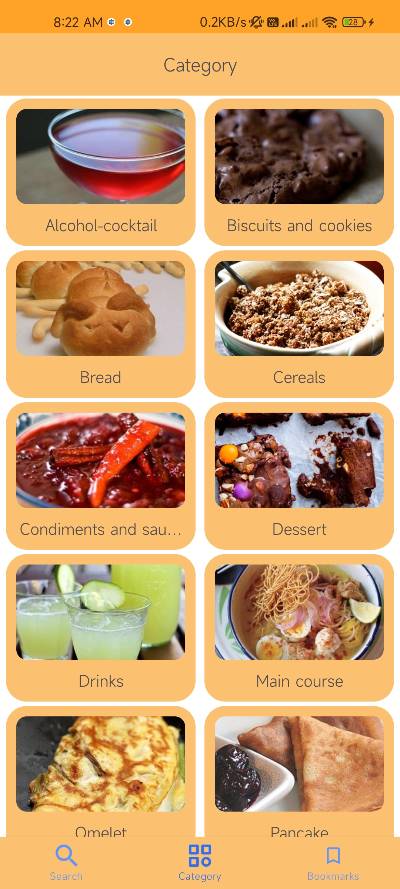
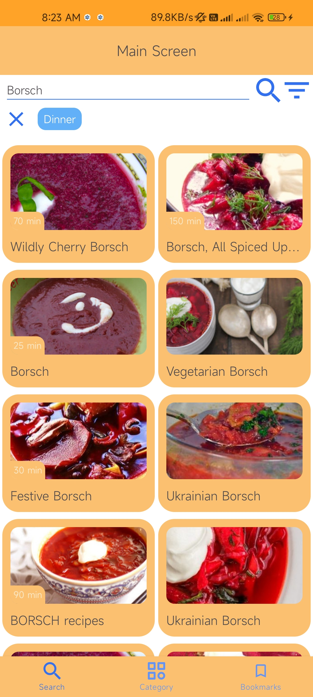
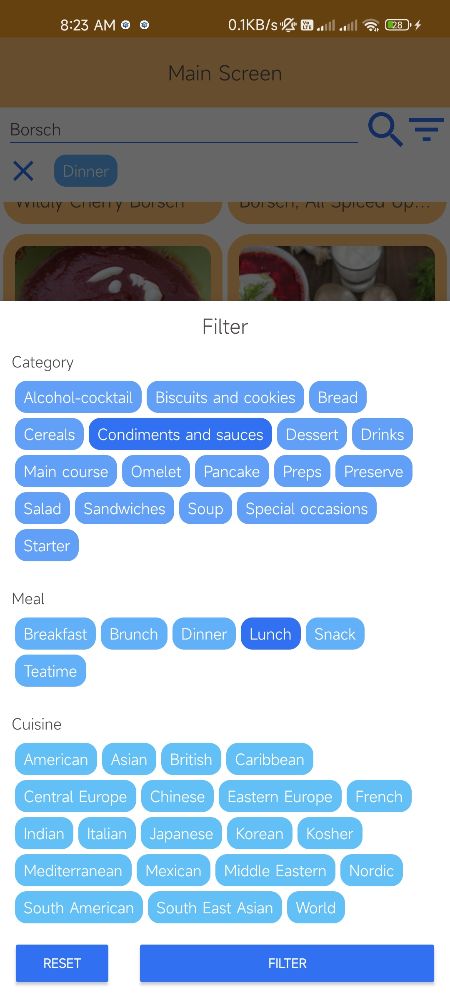
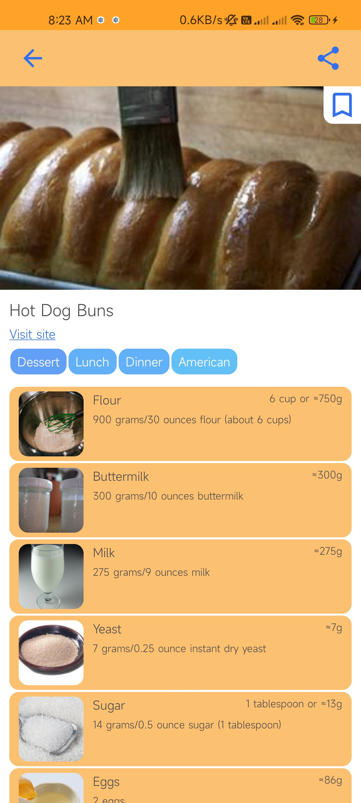
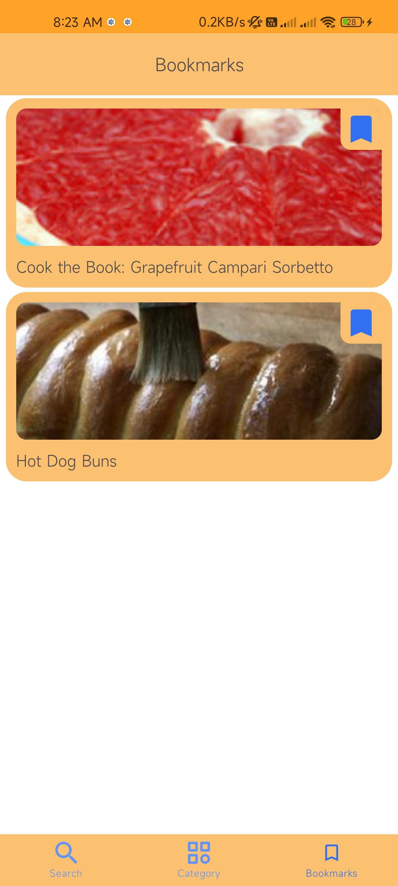

Recipe App
======

**It’s single activity app with MVVM architecture designed according to Google recommendations, as RestAPI used Edamam
Recipe Search API and implemented in app with Retrofit, used pagination(Paging 3), added caching via Room and Room is
used as local database for bookmarks, filter selected by user is saved in SharedPreferences and deep linking is
implemented via Firebase.**

Screenshots
-----------

<table>
  <tr>
    <td>Categories</td>
    <td>Search</td>
    <td>Filter dialog</td>
  </tr>
  <tr>
    <td></td>
    <td></td>
    <td></td>
  </tr>
  <tr>
    <td>Detail screen with share options</td>
    <td>Bookmarks</td>
  </tr>
  <tr>
    <td></td>
    <td></td>
  </tr>
 </table>

Libraries used in this project
------------------------------

* [Lottie][2]
* [Retrofit][3]
* [Glide][4]
* [Paging 3][5]
* [Room][6]
* [Firebase][7]

[APK][1]
-------

[1]: ./RecipeApp_1.0.0.apk
[2]: https://github.com/airbnb/lottie-android
[3]: https://square.github.io/retrofit/
[4]: https://github.com/bumptech/glide
[5]: https://developer.android.com/topic/libraries/architecture/paging/v3-overview
[6]: https://developer.android.com/training/data-storage/room
[7]: https://firebase.google.com/products/dynamic-links

